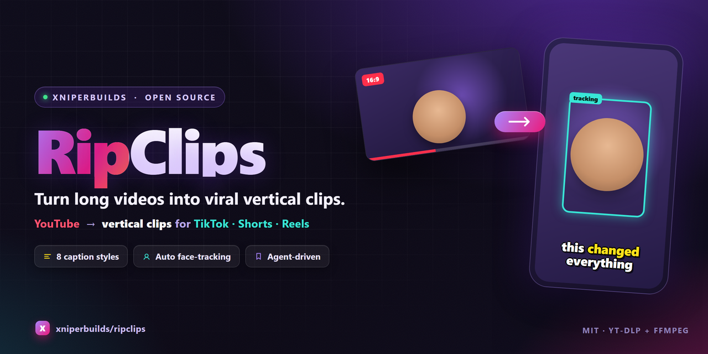

<p align="center">
  
</p>

# RipClips — Turn Long YouTube Videos into Viral Vertical Clips

**RipClips** is an agent-driven pipeline that repurposes long-form YouTube videos into short, vertical, captioned clips ready for **TikTok, YouTube Shorts, and Instagram Reels** — automatically. Paste a YouTube link into your AI coding agent (Claude Code, Codex, Cursor) and RipClips runs the whole flow: transcript → best-moment detection → download → cut → vertical reframe → burned-in captions.

No paid clipping subscription. No per-clip AI API key. Just `yt-dlp` + `FFmpeg` and the agent you already use.

---

## ✨ Features

- **End-to-end automation** — one YouTube URL in, upload-ready vertical clips out.
- **Smart moment detection** — the agent reads the transcript and picks the strongest, most clip-worthy moments (no external sentiment API).
- **Two reframe modes**
  - **General** (default) — auto face-tracking follows the dominant speaker in any video; centers cleanly when no face is found.
  - **Podcast** — rotates the crop between two speakers, whose positions are **auto-detected from the clip** (or fixed manually) for that classic interview-clip feel.
- **8 caption styles** — TikTok Classic, Word Pop, Podcast Modern, Word-by-Word, Highlight Karaoke, Bold Yellow, Neon, Boxed Bar — each fully customizable (font, size, colors, position, uppercase). Captions auto-wrap so text never runs off-screen.
- **Resilient downloads** — auto-retries YouTube's "confirm you're not a bot" gate with alternate clients.
- **Vertical 1080×1920** output, subtitles baked in.
- **Cross-platform** — Windows, macOS, Linux. One-command setup.
- **Config-driven** — quality, mode, framing, and caption style all live in `config.yaml`.
- **Works in any agent** — ships with `AGENTS.md` (Codex/Cursor) and a Claude Code skill.

---

## 🧭 How it works

```
YouTube URL
   │
   ▼
1 Transcript ─► 2 Clip Analysis ─► 3 Download ─► 4 Clip Export ─► 5 Vertical Reframe ─► 6 Subtitle Burn
```

| Step | Folder | Output |
|------|--------|--------|
| 1 | `1_transcript/` | timestamped `.srt` |
| 2 | `2_analysis/` | `clip_durations.txt` (best moments) |
| 3 | `3_download/` | full `.mp4` |
| 4 | `4_clip/` | `clip_XX.mp4` |
| 5 | `5_reframe/` | vertical `clip_XX.mp4` |
| 6 | `6_captions/` | final captioned `clip_XX.mp4` |

Each folder has a `*.directive.md` the agent reads before running that step.

---

## 🚀 Quick start

### 1. Install
```bash
git clone https://github.com/xniperbuilds/ripclips.git
cd ripclips
```
Windows:
```powershell
powershell -ExecutionPolicy Bypass -File setup.ps1
```
macOS / Linux:
```bash
bash setup.sh
```
This creates a `.venv`, installs Python deps, and installs FFmpeg.

### 2. Run it with your agent
Open the folder in **Claude Code**, **Codex**, or **Cursor** and say:

> Make TikTok clips from https://youtu.be/VIDEO_ID

The agent reads `AGENTS.md` and runs steps 1–6, pausing once to let you pick a caption style. Final clips land in `6_captions/captioned_clips/`.

### Run steps manually (optional)
```bash
python 1_transcript/transcript_agent.py "YOUTUBE_URL"
# create 2_analysis/clip_durations.txt (agent picks moments)
python 3_download/download_video.py "YOUTUBE_URL"
python 4_clip/cut_clips.py
python 5_reframe/reframe.py
python 6_captions/burn_subtitles.py --style 1
```

---

## ⚙️ Configuration (`config.yaml`)

```yaml
mode: general            # general (default) | podcast
download: { max_height: 1080 }
clip:    { encode_mode: reencode }
reframe:
  detector: opencv       # opencv (auto face-track) | center
  podcast_calibrate: true  # auto-detect the two speaker positions
captions:
  default_style: 1       # 1-8 (see below)
  font: ""               # font family name or .ttf path
  size: 0                # 0 = preset default
  primary_color: ""      # e.g. "#FFE94A"
  outline_color: ""
  uppercase: false
  margin_pct: 8          # safe side/bottom margin (overflow guard)
```

Every caption value can also be set per-run via CLI flags, e.g.:
```bash
python 6_captions/burn_subtitles.py --style 6 --font "Montserrat" --size 84 --color "#FFE94A" --uppercase
```

**Podcast framing:** by default the two speakers are auto-detected. To set them by hand, put `podcast_calibrate: false` and tune `5_reframe/speakers.json` (`x` = crop center, 0=left, 1=right). Preview with `python 5_reframe/reframe.py --dry-run`.

---

## 🎬 Caption styles

| # | Name | Look |
|---|------|------|
| 1 | TikTok Classic | Bold white, thick black outline |
| 2 | Word Pop | Yellow on a dark box |
| 3 | Podcast Modern | Clean white, soft shadow |
| 4 | Word-by-Word | One word at a time (karaoke) |
| 5 | Highlight Karaoke | Full line stays, spoken word lights up |
| 6 | Bold Yellow | Big punchy yellow, thick outline |
| 7 | Neon | Bright cyan with dark outline |
| 8 | Boxed Bar | White text on a solid color bar |

All styles honor the `captions:` overrides (font, size, colors, position, uppercase, margins).

---

## 📦 Requirements

- Python 3.9+
- [`yt-dlp`](https://github.com/yt-dlp/yt-dlp) and [`FFmpeg`](https://ffmpeg.org/) (installed by the setup script)
- `opencv-python` (auto face-tracking) and `PyYAML` — installed from `requirements.txt`
- An AI coding agent to orchestrate (Claude Code / Codex / Cursor)

---

## 🔁 Reset
Clear generated clips before a new run — see `cleanup.md` (removes only generated outputs, never your config or source).

---

## 📄 License
MIT © XniperBuilds. Use responsibly and respect the copyright of any source video you process.

---

*Keywords: youtube to tiktok, video clipping tool, shorts generator, reels maker, auto captions, vertical video, podcast clips, faceless clips, repurpose long-form video, yt-dlp ffmpeg clipper.*
